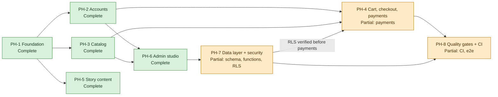

# Phase status

Explained in [implementation/phase-plan.md](../implementation/phase-plan.md). Green phases are complete, amber phases are partial.

```mermaid
flowchart LR
  P1["PH-1 Foundation<br/>Complete"]:::done
  P2["PH-2 Accounts<br/>Complete"]:::done
  P3["PH-3 Catalog<br/>Complete"]:::done
  P4["PH-4 Cart, checkout, payments<br/>Partial: payments"]:::partial
  P5["PH-5 Story content<br/>Complete"]:::done
  P6["PH-6 Admin studio<br/>Complete"]:::done
  P7["PH-7 Data layer + security<br/>Partial: schema, functions, RLS"]:::partial
  P8["PH-8 Quality gates + CI<br/>Partial: CI, e2e"]:::partial

  P1 --> P2 --> P4
  P1 --> P3 --> P4
  P1 --> P5
  P2 --> P6
  P3 --> P6
  P6 --> P7
  P7 -->|"RLS verified before payments"| P4
  P4 --> P8
  P7 --> P8

  classDef done fill:#d8f0dc,stroke:#2e7d32,color:#1b3d1f
  classDef partial fill:#fdebc8,stroke:#b26a00,color:#4a2c00
```
