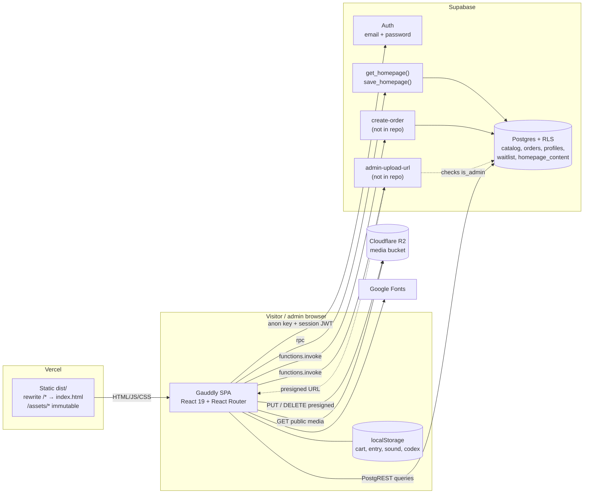

# System context

Explained in [architecture/system-overview.md](../architecture/system-overview.md).

```mermaid
flowchart LR
  subgraph Browser["Visitor / admin browser"]
    SPA["Gauddly SPA<br/>React 19 + React Router"]
    LS[("localStorage<br/>cart, entry, sound, codex")]
    SPA --- LS
  end

  subgraph Vercel
    Static["Static dist/<br/>rewrite /* → index.html<br/>/assets/* immutable"]
  end

  subgraph Supabase
    Auth["Auth<br/>email + password"]
    PG[("Postgres + RLS<br/>catalog, orders, profiles,<br/>waitlist, homepage_content")]
    RPC["get_homepage()<br/>save_homepage()"]
    CO["create-order<br/>(not in repo)"]
    UP["admin-upload-url<br/>(not in repo)"]
    RPC --> PG
    CO --> PG
    UP -. checks is_admin .-> PG
  end

  R2[("Cloudflare R2<br/>media bucket")]
  Fonts["Google Fonts"]

  Static -->|HTML/JS/CSS| SPA
  SPA -->|anon key + session JWT| Auth
  SPA -->|PostgREST queries| PG
  SPA -->|rpc| RPC
  SPA -->|functions.invoke| CO
  SPA -->|functions.invoke| UP
  UP -. presigned URL .-> SPA
  SPA -->|PUT / DELETE presigned| R2
  SPA -->|GET public media| R2
  SPA --> Fonts
```
